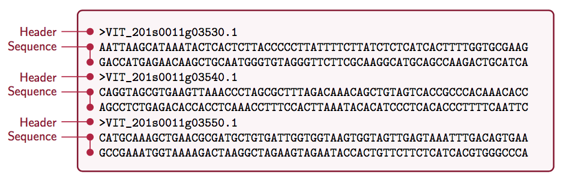

# 1.1) Introduction

In Chaves (2019), we discuss on the application of knowledge on the Biological Association between genotype (the DNA polymorphisms) and phenotype using statistical software (PLINK). We also had an introduction to programming, with the installation of libraries in R and and Bash and a brief discussion on how to process files using R and Bash. Here, we expand the notion of a text file, to the notion of information stored in the form of text. Therefore, in a file, we can also store a biological sequence. The first biological sequence storage file that we should discuss should be the FASTA file. Our discussion should also include information stored in FASTQ, SAM, BAM, BCF and VCF files. In this notebook, we will use information stored in a VCF file to generate commands that allow us to extract useful information from the files we analyze.

# 1.2) Introduction: what will we do today

* Download FASTA files from GISAID database using the period 07/01/2020 to 12/31/2020 as reference
* This is an approximation to the begin of detection of SARS-CoV-2 new variants
* Fragment each of the 317 downloaded sequences (in the case of samples from Brazil)
* Align sequences to Reference Genome
* Compare and identify variants
* Produce alignment and variant files


# 1) FASTA file




# 1) Explaining the Pipeline

In this notebook, we deepen the analysis of sequences with the beginning of the Identification of Genetic Variants. Here, we treat genetic variants as DNA polymorphisms. A DNA polymorphism is a mutation or variant, which differs from the nucleotide found at the same position in the FASTA sequence used as a reference. Thus, the present *pipeline* defines the computational protocol for Biological or Genetic Association with a phenotypic trait. In English this computational protocol is called *Variant Call*.

# 1) Explaining the Pipeline: SNPs

In this Booklet, we will make a *Variant Call* using FASTA files that contain the SARS-CoV-2 genome, which is the biological sequence of the virus genome, in a text file, specifically called FASTA (Figure 1). We identified SARS-CoV-2 variants using samtools and bcftools to extract genetic polymorphisms from FASTA files. The FASTA file must be downloaded from GISAID and stored locally, in a folder on the researcher's local system. Genetic variants, also called SNPs (*Single Nucleotide Polymorphisms*), are determined by comparing a FASTA file used as a reference, with the isolated sequence of the geographic region of interest.

# 1) Explaining the Pipeline: GISAID Database

By comparing the FASTA sequence of each region of the planet to a reference FASTA sequence, for example the first FASTA sequence corresponding to the initial patient presenting symptoms of respiratory syndrome, later identified as caused by SARS-CoV-2, we can note each position where there is a nucleotide different from the FASTA reference sequence obtained from the first Chinese patient. We say, then, that in the other regions, there are virus mutations, or, more technically, polymorphisms of the viral genetic material. FASTA files from virtually every region of the planet can be obtained from the German GISAID (Global Initiative on Sharing Avian Influenza Data) database. Information about the GISAID database can be obtained from its website:

https://www.gisaid.org

# 1) Explaining the Pipeline: Gene Expression Omnibus (GEO)

In Computational Biology Notebook Number 6, we will learn how to identify genetic variants using FASTQ files instead of FASTA files. FASTQ files can be analyzed directly from a database called *Gene Expression Omnibus* (GEO). The advantage of GEO compared to GISAID is that if the proper pipeline of identification of genetic variants in GEO is used, local storage of sequencing files is not required.

# 1) *script* submission to computational server

Often, the amount of sequencing data to be analyzed is so large that it is necessary to use computers with super-powerful storage capacity. The part below, encoded in Bash, is made using the Linux Operating System. The code represents a type of "header" that must be included for submitting scripts using the Linux system on computer servers.

# 1) *script* submission to computational server


```{bash, eval = F}
#!/bin/bash
#SBATCH --partition=128x24
##SBATCH --job-name=Variants_BWA # Job name
##SBATCH --mail-type=ALL              # Mail events (NONE, BEGIN, END, FAIL, ALL)
##SBATCH --mail-user=gchaves@ucsc.edu  # Where to send mail	
##SBATCH --nodes=1                    # Use one node
##SBATCH --ntasks=1                   # Run a single task	
##SBATCH --cpus-per-task=4            # Number of CPU cores per task
##SBATCH --output=Variants_BWA     # Standard output and error log
# 
# module load gcc/5.4.0
source ~/.bashrc
```

# 2) Dealing with your computer system architecture: Creating Folders for Data Storage

File organization is essential for clear and organized steps in the various procedures used, often without perfect visualization of how the computer performs. The excerpt below creates folders for the storage of the reference FASTA file, the FASTA files of the region of interest (Brazil), the SAM and BAM alignment files and finally, the BCF and VCF files, which contain information about the location in the linear genome , of the position of the identified mutations. VCF files are extracted in two ways, one containing SNPs and one containing indels.

```{r, eval=F}
# Store Figures
if (!dir.exists("../figures")) {
  dir.create("../figures")
}

# Store reference FASTA
if (!dir.exists("../fasta_reference_file")) {
  dir.create("../fasta_reference_file")
}

# Store reference FASTA
if (!dir.exists("../regions")) {
  dir.create("../regions")
}

# Store files from Brazil
if (!dir.exists("../regions/brazil")) {
  dir.create("../regions/brazil")
}

# Create the year for samples
if (!dir.exists("../regions/brazil/2020")) {
  dir.create("../regions/brazil/2020")
}

# Store FASTA for regions
if (!dir.exists("../regions/brazil/2020/fasta/")) {
  dir.create("../regions/brazil/2020/fasta/")
}


# Store BAM files
if (!dir.exists("../regions/brazil/2020/bam")) {
  dir.create("../regions/brazil/2020/bam")
}

# Store BCF files
if (!dir.exists("../regions/brazil/2020/bcf")) {
  dir.create("../regions/brazil/2020/bcf")
}

# Store FASTA files
if (!dir.exists("../regions/brazil/2020/fasta")) {
  dir.create("../regions/brazil/2020/fasta")
}

# Store SAM files
if (!dir.exists("../regions/brazil/2020/sam")) {
  dir.create("../regions/brazil/2020/sam")
}

# Store VFC files
if (!dir.exists("../regions/brazil/2020/vcf")) {
  dir.create("../regions/brazil/2020/vcf")
}


# Store VCF from SNPs
if (!dir.exists("../regions/brazil/2020/vcf_snp")) {
  dir.create("../regions/brazil/2020/vcf_snp")
}

# Store VCF from indels
if (!dir.exists("../regions/brazil/2020/vcf_indel")) {
  dir.create("../regions/brazil/2020/vcf_indel")
}
```


# 2) General Organization of the Pipeline

The following steps must be performed by the genetic variant identification pipeline:

* Indexing

* Alignment

* Identification of variants

* Extracting and exporting variants

* Calculation of genotype or allele frequencies

# 2.1) Indexing Using BWA Program

* Indexing only needs to be done once

* The same index is used for aligning different samples using a single FASTA reference sequence.

```{bash}
~/anaconda3/bin/bwa index -a bwtsw ../fasta_reference_file/SARS-CoV-2.fasta
```

# 2.1) What is indexing for?

* Indexing a genome can be explained similar to indexing a book.
* If you want to know on which page a certain word appears or a chapter begins, it is much more efficient/faster to look it up in a pre-built index than going through every page of the book until you found it.
* Same goes for alignments.

# 2.1) What is indexing for?

* Indices allow the aligner to narrow down the potential origin of a query sequence within the genome, saving both time and memory.

* You may have a look at Ben Langmeads youtube channel (creator of the bowtie and bowtie2 alignment software), where he lectures about concepts of sequence alignments, including the idea of indexing.

# 2.1) What is indexing for?

* References

https://www.biostars.org/p/212594/

https://www.youtube.com/user/BenLangmead

# 2.2) Download and split FASTA

* Download FASTA files by region and save in SARS-CoV-2_Regions folder, to split it by sample;

* Below, the FASTA file was downloaded and saved as Brazil_2020_07_01-2020_12_31.fasta, indicating the period and geographic region;

* The Brazil_2020_07_01-2020_12_31.fasta file must be saved in SARS-CoV-2_Regions before running *chunk* below;

* The FASTA file downloaded from GISAID is named according to the region (Brazil) and the dates of collection and submission of the files;

* It is necessary to install the **splitfasta** program to "break" the downloaded FASTA file.

```{bash}
## Change directory to regions folder
cd ../regions

## Use splitfasta to split big FASTA file into its pieces.
/Users/gepolianochaves/anaconda3/bin/splitfasta Brazil_2020_07_01-2020_12_31.fasta
```

# 2.3) Move FASTA files

* Move FASTA file to specific region

* We want to see frequency of new variants between July and December

* We need to pay attention to the names of created folders and files

```{bash}
cp ../regions/Brazil_2020_07_01-2020_12_31_split_files/Brazil* ../regions/brazil/2020/fasta
```

# 2.4) Create FASTA file list

* View FASTA file list in Brazil folder;


```{bash}
cd ../regions/brazil/2020/fasta
for i in Brazil*; do echo $i; done
```

# 2.4) Counting number of FASTA files in Brazil folder

```{bash}
cd ../regions/brazil/2020/fasta
for i in Brazil*; do echo $i; done | wc -l
```

* Create list with FASTA files from Brazil;

```{bash}
cd ../regions/brazil/2020/fasta
for i in Brazil*; do echo $i; done > COVID_List_Region.txt
wc -l COVID_List_Region.txt ## Total number of FASTA files
```


# 3) Alignment in *for loop*

```{bash, eval = F}

for fasta_file in $(cat ../regions/brazil/2020/fasta/COVID_List_Region.txt); do 

  ## Print names of the fasta file
  echo $fast_file
  
  ## Alignment
  bwa mem -M -R \
  '@RG\tID:SampleCorona\tLB:sample_1\tPL:ILLUMINA\tPM:HISEQ\tSM:SampleCorona' \
  ../fasta_reference_file/SARS-CoV-2.fasta \
  ../regions/brazil/2020/fasta/$fasta_file > \
  ../regions/brazil/2020/sam/$fasta_file".sam"
  
  ## SAM to BAM
  samtools view -S -b .$fasta_file".sam" > \
  ../regions/brazil/2020/bam/$fasta_file".bam"
  
    ## This part is different in the VMs
  bcftools mpileup --fasta-ref ../fasta_reference_file/SARS-CoV-2.fasta ../regions/brazil/2020/bam/$fasta_file".bam" > \
  ../regions/brazil/2020/bcf/$fasta_file".bcf"
  
  ## Bcftools extracts SNPs
  bcftools view -v snps ../regions/brazil/2020/bcf/$fasta_file".bcf" > ../regions/brazil/2020/vcf_snp/$fasta_file"_snps.vcf"

  ## Bcftools extracts indels
  bcftools view -v indels ../regions/brazil/2020/bcf/$fasta_file".bcf" > ../regions/brazil/2020/vcf_indel/$fasta_file"_indels.vcf"

done
```

# 4) Counting the number of mutations

```{bash}
cd brazil_vcf_julDec_snp

echo "Mutation N501Y"
grep -w 23063 * | wc -l #2/250 files
grep -w 23064 * | wc -l # 0/250 files
grep -w 23065 * | wc -l # 0/250 files
echo "Mutation P681H"
grep -w 23603 * | wc -l # 0/250 files
grep -w 23604 * | wc -l # 2/250 files
grep -w 23605 * | wc -l # 0/250 files
echo "HV 69–70 deletion"
grep -w 21766 * | wc -l
grep -w 21767 * | wc -l
grep -w 21768 * | wc -l
grep -w 21769 * | wc -l
grep -w 21770 * | wc -l
grep -w 21771 * | wc -l
grep -w 21772 * | wc -l
echo "Mutations from Yin"
grep -w 241 * | wc -l
grep -w 3037 * | wc -l
grep -w 11083 * | wc -l
grep -w 14408 * | wc -l
grep -w 17747 * | wc -l
grep -w 17858 * | wc -l
grep -w 18060 * | wc -l
grep -w 23403 * | wc -l
grep -w 26144 * | wc -l
grep -w 27046 * | wc -l
grep -w 28144 * | wc -l
grep -w 28881 * | wc -l
grep -w 28882 * | wc -l
grep -w 28883 * | wc -l
```

# 5.1) Implementation of Allelic Frequency Calculation (Original Script)

* To attribute the result of the computational evaluation to the variable, the following reference was consulted:

https://stackoverflow.com/questions/4651437/how-do-i-set-a-variable-to-the-output-of-a-command-in-bash

```{bash}
cd brazil_fasta_julDec
NumeroTotalFASTA=$(for i in Brazil*; do echo $i; done | wc -l)
echo "${NumeroTotalFASTA}"


cd ~/Desktop/Gepoliano/SARS-CoV-2_Analysis/brazil_vcf_julDec_snp
NumeroN501Y=$(grep 23063 * | wc -l )
echo "${NumeroN501Y}"

echo "scale=3; ${NumeroN501Y} / ${NumeroTotalFASTA} " | bc


##frequency= ( $NumeroTotalFASTA / $NumeroN501Y )
##echo " A Frequência é de N501Y = $frequency"
```


# 5.2) Calculate Several Frequencies

```{bash}
## Count total number of FASTA files
cd brazil_fasta_julDec
NumeroTotalFASTA=$(for i in Brazil*; do echo $i; done | wc -l)
echo "${NumeroTotalFASTA}"

## Check current directory
pwd

## Go back to the previous directory, because VCF files are stored inside it
cd ..

## Go to VCF file directory and count number of times a mutation is observed
cd brazil_vcf_julDec_snp
NumeroN501Y=$(grep 23063 * | wc -l )
echo "${NumeroN501Y}"

## Print resut of frequency calculation to screen
echo "scale=3; ${NumeroN501Y} / ${NumeroTotalFASTA} " | bc


```


# 5.3) Calculate Frequency of Variants per Region in for loop

```{bash}
cd brazil_fasta_julDec
NumeroTotalFASTA=$(for i in Brazil*; do echo $i; done | wc -l)

cd ..

for Variant in $(cat VariantList.txt.tmp); do
  Variant_Total_Occurrences=$(grep $Variant brazil_vcf_julDec_snp/* | wc -l )
  echo "scale=2; 100*${Variant_Total_Occurrences} / ${NumeroTotalFASTA} " | bc
  #echo "scale=3; ${Variant_Total_Occurrences} / ${NumeroTotalFASTA} " | bc
done
```

# 6) Viewing Variants of Interest

* Polar interactions between the SARS-CoV-2 Spike RBD protein (white) and the human ACE2 protein (blue) calculated by Pymol using the mutagenesis tool.

{width=90%}

# 6) Viewing Variants of Interest
 
 A) Interaction of wild-type ASN501 (N501) residue in the Spike SARS-CoV protein binding domain (RBD) with tyrosine 41 in ACE2;


{width=90%}

# 6) Viewing Variants of Interest
 
 B) When Asparagine is replaced by Tyrosine in RBD, the number of possible hydrogen interactions increases between Spike RBD and ACE2, possibly explaining the greater affinity between the virus Spike protein and ACE2.


{width=90%}


# 7) References: Identification of Variants

* Brazil, South Africa and UK variants

https://www.the-scientist.com/news-opinion/a-guide-to-emerging-sars-cov-2-variants-68387

* *Variant call* Samtools

https://www.ebi.ac.uk/sites/ebi.ac.uk/files/content.ebi.ac.uk/materials/2014/140217_AgriOmics/dan_bolser_snp_calling.pdf

# 7) References: 3D Protein Visualization with Pymol

* ACE2 and RBD interaction model of Spike protein:

https://www.youtube.com/watch?v=hcnnKrlqa9M

* Protein Data Bank Structure (PDB):

https://www.rcsb.org/structure/6VW1

* Indicating amino acids in Pymol:

https://www.youtube.com/watch?v=nFY3EjBNPBQ

* Mutagenesis using Pymol:

https://www.youtube.com/watch?v=M-VCBz83nfs

