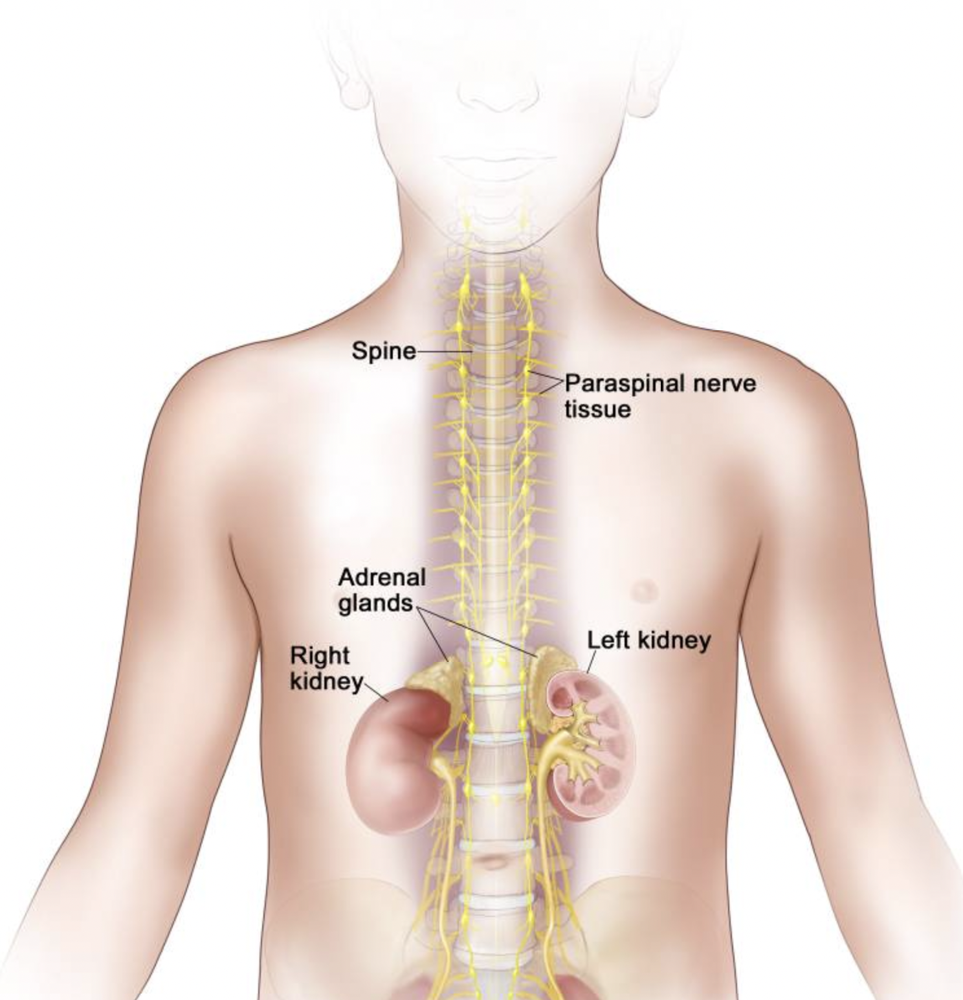

We analyse neuroblastoma and SARS-CoV-2 datasets using R, the terminal (Bash) and Python.

Syllabus, past materials and lectures can be found in the following links:

1) [ReComBio Slides](https://docs.google.com/presentation/d/12SRZvPIyyqakpi4PASBkZc0hAlBhHBzw/edit#slide=id.p1)
2) [Syllabus](https://drive.google.com/drive/u/0/folders/112uVPnDxn77N8NuXTLIpo83VoILpCW-F)
3) [Recordings](https://drive.google.com/drive/u/0/folders/1GzV2gBVUNHlpKLPrYDvTS07DxeUAw6Td)

In the Notebooks tab, completed notebooks are found with the commands in the languages used.

