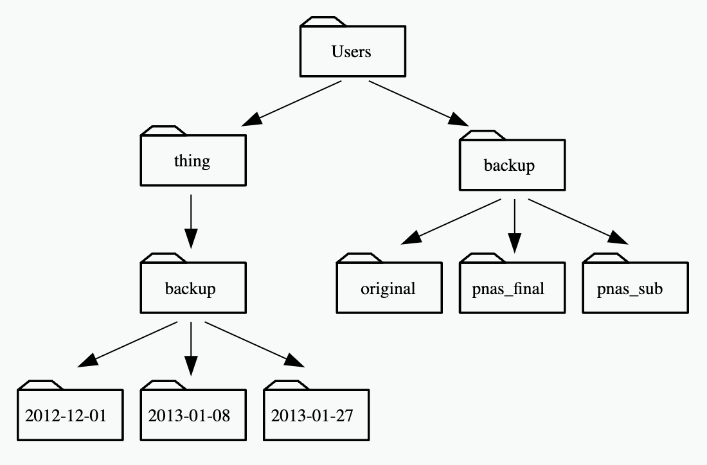
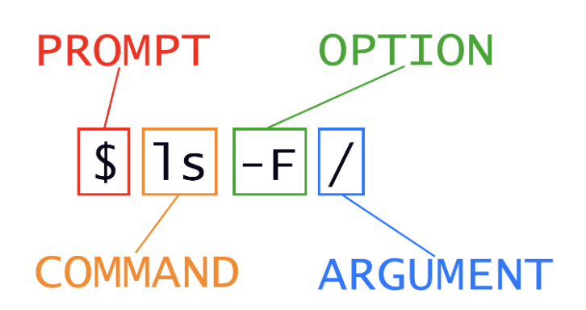

# 1. Introducing the Shell

print working directory

```{bash}
pwd
```

list

```{bash}
ls
```

# 1. Introducing the Shell (continued)

command not found

```{bash, eval= F}
pws
```

# 2. Navigating files and directories

```{bash}
pwd
```

Indicate directory with slash and file without slash

```{bash}
ls -F
```

# 2. Navigating files and directories (continued)

Getting help

```{bash, eval=F}
ls --help
```

Read the manual of the command

```{bash, eval=F}
man ls
```

# 2. Navigating files and directories (continued)

Move to different directory

```{bash}
cd ../
ls
```

# 2. Navigating files and directories (continued)

```{bash}
 ls -F -a
```

# 2. Navigating files and directories (continued)

move to the Desktop folder

```{bash}
cd ~/Desktop
ls
```

# 2. Navigating files and directories (continued)

Absolute vs. Relative Paths

{width=60%}

# 2. Navigating files and directories (continued)

General syntax of the shell command

{width=60%}


# 3. Working With Files and Directories

* Create a directory using the mkdir command

```{bash, eval=T}
mkdir -p thesis
```

# 3. Working With Files and Directories (continued)

* List the files in the current directory. If the option -a is included, folders are included as well

```{bash}
ls -F -a
```

# 3. Working With Files and Directories (continued)

* Let’s check what is the current directory and change our working directory to test using cd

* Then run a text editor called Touch to create a file called draft.txt. 

* Finally, we will check that we created the file with the ls command:

# 3. Working With Files and Directories (continued)

```{bash}
pwd
cd thesis
touch draft.txt
ls
```

# 3. Working With Files and Directories (continued)

* Let's go back to the scripts folder

```{bash}
# check the current directory
pwd
# change to the test directory
cd ./thesis
# check the current directory
pwd
# change to the scripts directory
cd ../
# check the current directory
pwd
```

# 3. Working With Files and Directories (continued)


```{bash}
# check the current directory
pwd
# Move draft.txt to current directory
mv ./thesis/draft.txt ./
# List current directory
ls
# Move draft.txt back to ./thesis
mv draft.txt ./thesis/
# change to thesis directory 
cd ./thesis
# List current directory and confirm draft there
ls
```

# 3. Working With Files and Directories (continued)

* Removing files and directories

```{bash, error=TRUE}
ls ./thesis/draft.txt
rm ./thesis/draft.txt
ls ./thesis/draft.txt
ls ./thesis/
du -sh ./thesis/
```

# 3. Working With Files and Directories (continued)

* Removing the thesis directory

```{bash, error=TRUE}
ls
echo "Not using the -r option:"
rm thesis
ls
```

# 3. Working With Files and Directories (continued)

```{bash}
ls
echo "Using the -r option:"
rm -r thesis
ls
```

# 4. Pipes and Filters

* wc counts lines, words, and characters in its inputs.

* cat displays the contents of its inputs.

* sort sorts its inputs.

* head displays the first 10 lines of its input.

# 4. Pipes and Filters (continued)

* tail displays the last 10 lines of its input.

* command > [file] redirects a command’s output to a file (overwriting any existing content).

* command >> [file] appends a command’s output to a file.

* [first] | [second] is a pipeline: the output of the first command is used as the input to the second.

* The best way to use the shell is to use pipes to combine simple single-purpose programs (filters).

# 5. Loops

* Let's count how many FASTA files are there in the fasta folder of the brazil region for 2020

* We will use a for loop used in the 

* We will come across this again in the Variant Call Pipeline that we will study

# 5. Loops (continued)

* Print the names of every FASTA file.

```{bash}
cd ../../2-Variant-Call-Pipeline/regions/brazil/2020/fasta
for i in Brazil*; do echo $i; done
```

# 5. Loops (continued)

* Let's pipe this output into the wc command and let's have it count how many files, for us.

```{bash}
cd ../../2-Variant-Call-Pipeline/regions/brazil/2020/fasta
for i in Brazil*; do echo $i; done | wc
```

* Now count only the number of lines

```{bash}
cd ../../2-Variant-Call-Pipeline/regions/brazil/2020/fasta
for i in Brazil*; do echo $i; done | wc -l
```

# 6. Shell Scripts

* Variant call shell script: an alignment in a **for loop**

```{bash, eval = F}

Region=brazil

for fasta_file in $(cat brazil_fasta_julDec/COVID_List_Region.txt); do 

  ## Print names of Project Directory and FASTA file
  echo $ProjectDirectory
  echo $fast_file
  
  
  ## Alignment
  ~/anaconda3/bin/bwa mem -M -R \
  '@RG\tID:SampleCorona\tLB:sample_1\tPL:ILLUMINA\tPM:HISEQ\tSM:SampleCorona' \
  fasta_reference_file/SARS-CoV-2.fasta \
  brazil_fasta_julDec/$fasta_file > \
  brazil_alignment_julDec_sam/$fasta_file".sam"
  
  
  ## SAM to BAM
  samtools view -S -b $Region"_alignment_julDec_sam"/$fasta_file".sam" > \
  $Region"_alignment_julDec_bam"/$fasta_file".bam"
  
  
  ## Samtools uses reference FASTA to detect "piles" in the alignment
  samtools mpileup -g -f fasta_reference_file/SARS-CoV-2.fasta $Region"_alignment_julDec_bam"/$fasta_file".bam" > \
  $Region"_julDec_bcf"/$fasta_file".bcf"
  
  ## Bcftools extracts SNPs
  ~/Desktop/Gepoliano/bcftools/bcftools view -v snps $Region"_julDec_bcf"/$fasta_file".bcf" > $Region"_vcf_julDec_snp"/$fasta_file"_snps.vcf"

  ## Bcftools extracts indels
  ~/Desktop/Gepoliano/bcftools/bcftools view -v indels $Region"_julDec_bcf"/$fasta_file".bcf" > $Region"_vcf_julDec_indel"/$fasta_file"_indels.vcf"

done
```

# 7. Finding Things

* The find command

```{bash}
pwd
find . -name "*Rmd" -print
```

* find names of figures of format png

```{bash}
pwd
find ../figures -name "*png" -print
```

# 7. Finding Things (continued)

* The grep command

```{bash}
grep "print" Introduction\ to\ the\ Terminal.Rmd 
```

# 7. Finding Things (continued)

* The cat and head commands

```{bash}
cat Introduction\ to\ the\ Terminal.Rmd | head 
```

# 8) References

<div id="refs"></div>


# 9) Session Info

```{r session}
sessionInfo()
```


